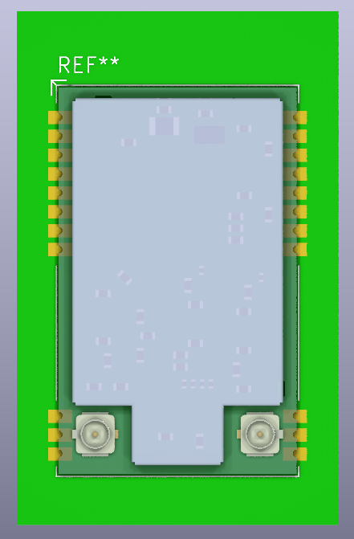

# EBYTE E80-x00M2213S Module

the repository just for my study how to use the module.

### KiCAD v8

* [footprint](KiCAD/E80-x00M2213S.kicad_mod)

#### Footprint preview

# Reference

* [EBYTE E80-900M2213S LR1121 LoRa module](https://www.cdebyte.com/products/E80-900M2213S)
* [E80-900M2213S User manual - English](https://www.cdebyte.com/pdf-down.aspx?id=3188)
* [E80-900M2213S 3D model(STEP)](https://www.cdebyte.com/pdf-down.aspx?id=3370)
