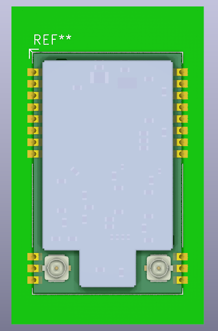

# EBYTE E80-x00M2213S Module

This repository documents my study and implementation of the EBYTE E80-x00M2213S module.

## Project Contents

### KiCAD v8 Resources
- [Module Footprint](KiCAD/E80-x00M2213S.kicad_mod)
- [Modificated STEP FILE](docs/E80-XXXM2213S_U.step), add pins

> **Important Note:** The dimensions between pin8/pin11 and pin16/pin19 are shown as 11.17mm in the official STEP model, which differs from the 11.20mm specified in the user manual. Please verify these measurements with your actual module before designing your PCB, as I haven't physically measured the module myself.

### Footprint Preview

## Features
- Custom KiCAD footprint design
- Pin spacing based on official STEP model
- Compatible with KiCAD version 8

## Documentation and Resources

### Official Documentation
- [Product Page: EBYTE E80-900M2213S LR1121 LoRa Module](https://www.cdebyte.com/products/E80-900M2213S)
- [User Manual (English)](https://www.cdebyte.com/pdf-down.aspx?id=3188)
- [3D Model (STEP Format)](https://www.cdebyte.com/pdf-down.aspx?id=3370)

## License
This project is open-source. Feel free to use and modify the KiCAD footprint according to your needs.

The demo source code, user manual, and STEP model are intellectual property of EBYTE. Please refer to EBYTE's official website for their usage terms and conditions.

## Contributing
Contributions, issues, and feature requests are welcome. Feel free to check the issues page if you want to contribute.
